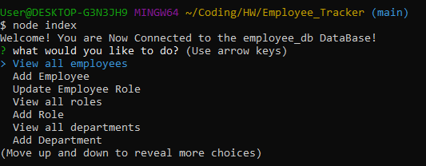
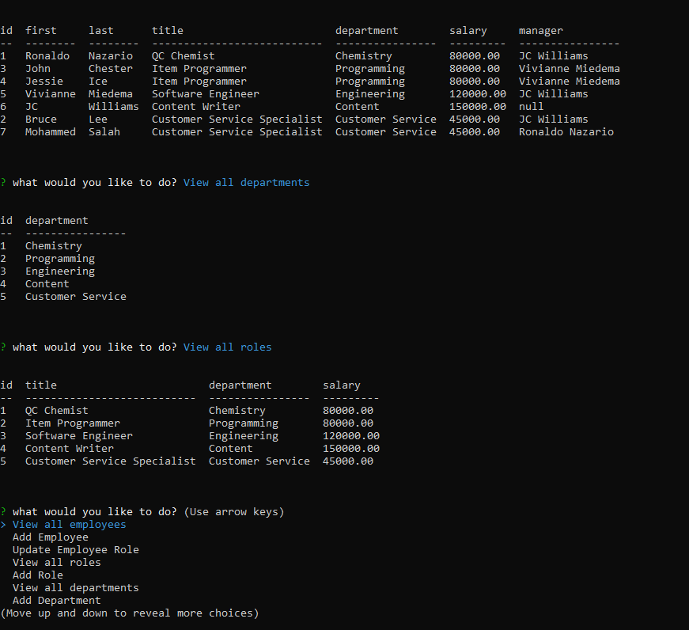

# Employee Tracker

## Description: In this application, a user such as a manager can access, view and/or update an employee database. After starting the application in terminal, a series of prompts are available for the user to select how to interact with the data base. The user can either view all employees, all roles, or all departments within the company. In addition, the user can add a new role, department, or employee as well as update the role of a current employee. 
---
### This application is initialized using command-line application, and access the employee database using mySQL. The resulting data are displayed using console.table.

### NOTE: This application utilizes the following node packages: inquirer version 8.2.4, console.table version 0.10.0, and mySQL2 version 2.2.5
---
---

## 
## 
---

## Table of Contents
  - [Installation](#installation)
  - [Usage](#usage)
  - [License](#license)
  - [Contributing](#contributing)
  - [Tests](#tests)
  - [Questions](#questions)

---
## Installation

A user can clone the files found in this repo then install the required node packages by running `npm i` in the command-line application. Be sure to supply your own `MySQL` password in the `index.js` file. Next, run the SQL commands found in `schema.sql` and `seeds.sql`. Finally, navigate to the cloned folder in terminal and run the command `node index.js`.

## Usage

In terminal and after installing the necessary node packages (as outlined above), navigate to the folder and then run the command `node index.js`. A series of prompts should appear and the user can select using the arrow keys.Reference the video linked below.

[Walkthrough Video](https://drive.google.com/file/d/1PfRGVTeL3hLlYq0GGZz-H6s3w1iMiM-S/view?usp=sharing)

## License

This application is unlicensed

## Contributing

Visit my GitHub or Send me an email

## Tests

There are no tests written at this time

---
## Questions

If you have any questions, please visit my GitHub or send me an email.

[GitHub Link](https://github.com/momaki9)

[Email Me!](mailto:mostafa_m9@yahoo.com)